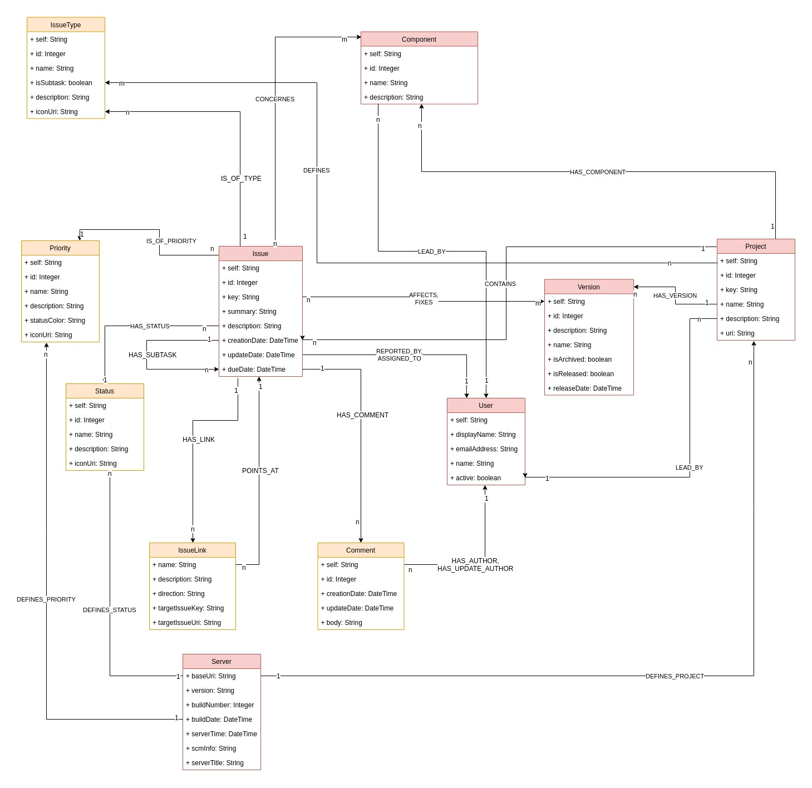

= jQAssistant Jira Plugin

This is a [Jira](https://www.atlassian.com/software/jira) parser for [jQAssistant](https://jqassistant.org/). 
It enables jQAssistant to scan and to analyze data from **Jira**.

== Using the jQAssistant Jira Plugin

To be able to use the plug-in, it must be specified as a plug-in to jQAssistant. Additionally, at least one Jira instance and one project needs to be configured to be scanned. This also includes the authentication information (via bearer token). Optionally, additional fields that are configured in your Jira project for issues can be specified.

NOTE:: The authentication token should not be specified in the YAML in case it is under version control. Use an environment variable instead.

[source, yaml]
----
jqassistant:
  plugins:
    - group-id: org.jqassistant.plugin <1>
      artifact-id: jqassistant-jira-plugin
      version: ${jqassistant.jira-plugin.version}
  scan:
    properties:
      jira.authentication.token: <bearer-token> <2>
      jira.custom.issue.fields: <custom field name(s) <3>
      jira.projects: <project-key(s)> <4>

  include:
    urls:
      - jira:server::<Jira server URL> <5>
----
<1> Dependency to the Jira plugin
<2> The bearer token for authentication
<3> List of additional Issue fields to scan (comma-separated)
<4> List of Projects to scan (comma-separated)

== Self-Signed Certificate

If your JIRA instance uses a self-signed certificate register it with the [Keytool](http://tutorials.jenkov.com/java-cryptography/keytool.html):

```bash
keytool -import -alias JIRA -file jira.crt -keystore $JAVA_HOME/jre/lib/security/cacerts
```

== Model



== Use Cases

=== Overview

[source,cypher]
.Count bugs per release
----
MATCH 
    (t:IssueType {name:'Bug'})<-[:IS_OF_TYPE]-(i:Issue)-[:AFFECTS]->(v:Version) 
RETURN 
    v.name as Version, count(i) as `Bug Total`
ORDER BY
    `Bug Total` DESC
----

[source, cypher]
.Count bugs by priority
----
MATCH 
    (t:IssueType {name:'Bug'})<-[:IS_OF_TYPE]-(i:Issue)-[:IS_OF_PRIORITY]->(p:Priority) 
RETURN 
    p.name as Priority, count(i) as `Issue Total`
ORDER BY
    `Issue Total` DESC
----

[source,cypher]
.Count issues by status
----
MATCH 
    (i:Issue)-[:HAS_STATUS]->(s:Status) 
RETURN 
    s.name as Status, count(i) as `Issue Total`
ORDER BY
    `Issue Total` DESC
----

=== User Overview

[source,cypher]
.Count reported issues per user
----
MATCH 
    (i:Issue)-[:REPORTED_BY]->(u:User) 
RETURN 
    u.name as User, count(i) as `Issue Total`
ORDER BY
    `Issue Total` DESC
----

[source,cypher]
.Count assigned issues per user
----
MATCH 
    (i:Issue)-[:ASSIGNED_TO]->(u:User) 
RETURN 
    u.name as User, count(i) as `Issue Total`
ORDER BY
    `Issue Total` DESC
----

=== Issue Relations

[source,cypher]
.Show issues with few links to other issues. Those are probably ones which can always be implemented
----
MATCH 
    (i:Issue)
RETURN 
    i.key as Issue, SIZE((i)-[:HAS_LINK]->()) as `Link Total`
ORDER BY
    `Link Total` ASC
----

[source,cypher]
.Show issues which are referenced by a lot of other issues. Those issues should be solved as soon as possible.
----
MATCH 
    (i:Issue)
RETURN 
    i.key as Issue, SIZE((i)<-[:POINTS_AT]-()) as `Reference Total`
ORDER BY
    `Reference Total` DESC
----

=== Issue Quality

[source,cypher]
.Show issues with a lot of comments. Probably the first description was not clear enough
----
MATCH 
    (i:Issue)
RETURN 
    i.key as Issue, SIZE((i)-[:HAS_COMMENT]->()) as `Comment Total`
ORDER BY
    `Comment Total` DESC
----

== Supported Jira Versions

Unfortunately, we did not find any documentation which Jira versions are supported by the https://mvnrepository.com/artifact/com.atlassian.jira/jira-rest-java-client-api/5.2.5[JIRA REST Java Client].
According to the https://bitbucket.org/atlassian/jira-rest-java-client/src/master/[BitBucket repository description]
every version newer than JIRA 4.2  is supported:

> Java client library (useful for any JVM languages) which allows to communicate with JIRA via its new REST API (JIRA 4.2 and newer).

If it does not work with your Jira instance please open an **Issue** and write your Jira version in there.